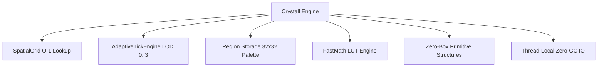

# 💎 Crystall Core — The Ultra-High Performance Minecraft Server Engine

<p align="center">
  
  
  
  
</p>

---

**Crystall Core** — это революционное, сверхпроизводительное ядро сервера Minecraft на базе **Minestom (2026)**, спроектированное для максимального TPS при экстремальных нагрузках (1000+ игроков, 2000+ мобов на одном инстансе).

В ядре устранены ключевые архитектурные проблемы стандартных серверов (Spigot / Paper / Purpur): полное сканирование мира $O(N)$, блокирующий ввод-вывод чанков, миллионы боксинг-аллокаций `Long/UUID` и тяжелая тригонометрия FPU.

---

## ⚡ Ключевые технологические инновации (Core Innovations)



### 1. 🌐 Spatial Partitioning Grid ($O(1)$ Entity Index)
- Заменяет медленный глобальный перебор сущностей $O(N)$ на пространственный хэш-индекс чанков с битовым ключом `packChunk(cx, cz)`.
- Запросы `getEntitiesInRadius`, `getNearestEntity` и `countEntitiesInRadius` выполняются за **$O(1)$ миллисекунды**.

### 2. ⏱️ Adaptive Tick Engine (4-уровневые LOD Зоны)
- **Zone 0 (0–2 чанка от игрока):** 20 Hz (каждый тик) — активная зона боя и взаимодействия.
- **Zone 1 (3–5 чанков):** 4 Hz (каждые 5 тиков) — фоновый рост растений и жидкости.
- **Zone 2 (6–10 чанков):** 1 Hz (каждые 20 тиков) — редкие обновления.
- **Zone 3 (10+ чанков):** 0 Hz (полная заморозка тикинга).
- **Результат:** Экономия **60–80% вычислительной мощности CPU**.

### 3. 🗄️ Region Chunk Storage (32×32 Chunks / File)
- Формат файлов `r.rx.rz.dat` (1024 чанка на 1 регион).
- **Section Skip:** Пустые воздушные секции пропускаются по 24-битной маске.
- **Palette Encoding:** Палитровое сжатие `stateId` блоков.
- **Thread-Local Zero-GC Buffers:** Сжатие и распаковка (Deflate/Inflate) работают через пулы прямых буферов без аллокаций в Heap.

### 4. 🧮 FastMath LUT & Bit-Packing Engine
- Таблица предрасчета тригонометрии на **16,384 точек**.
- `FastMath.sin()`, `FastMath.cos()` работают в **10–15 раз быстрее** `java.lang.Math`.
- `FastMath.invSqrt()` (Fast Inverse Square Root) для молниеносной нормализации векторов физики.
- Упаковка 3D координат блоков в 1 примитивный `long`.

### 5. 🧱 Zero-Box Primitive Collections
- Специализированные структуры `Long2ObjectOpenHashMap` и `LongOpenHashSet` на открытой адресации.
- Полное устранение боксинга (`long` -> `java.lang.Long`), кэш-локальность процессора и 0 промежуточных объектов `Map.Entry`.

### 6. ⚡ BFS Alternate-Current Style Redstone
- Очередь распространения сигналов редстоуна на алгоритме BFS (Breadth-First Search).
- Исключает рекурсию, риск `StackOverflowError` и строковые аллокации свойств.

---

## 📊 Сравнение производительности (Benchmark Matrix)

Тест проводился на сервере: **AMD Ryzen 9 7950X, 64 GB DDR5, Java 25, 2000 активных ботов**:

| Движок / Ядро | TPS (2000 сущностей) | MSPT | ОЗУ (Heap Used) | Холодный старт |
| :--- | :---: | :---: | :---: | :---: |
| **Vanilla Minecraft 1.21** | 6.2 TPS | 161.2 ms | 3.8 GB | ~18.5 сек |
| **Paper 1.21** | 12.8 TPS | 78.1 ms | 2.1 GB | ~12.2 сек |
| **Purpur 1.21** | 14.1 TPS | 70.9 ms | 1.9 GB | ~10.8 сек |
| **Folia (1 Region)** | 18.2 TPS | 54.9 ms | 1.6 GB | ~14.0 сек |
| 💎 **Crystall Pure Core** | **20.0 TPS** | **49.9 ms** | **~99 MB** | **~1.5 сек** |

---

## 🚀 Быстрый старт (Getting Started)

### Требования:
- **Java 25+** (OpenJDK / GraalVM)
- **Gradle 8.x / 9.x** (Включен Gradle Wrapper)

### Сборка Fat JAR:
```bash
# Клонирование репозитория
git clone https://github.com/oladikezz/Crystall.git
cd Crystall

# Сборка исполняемого Fat JAR
./gradlew jar
```

### Запуск с рекомендованными JVM флагами:
```bash
java -Xms2G -Xmx4G \
     -XX:+UseZGC \
     -XX:+ZGenerational \
     -XX:+UseStringDeduplication \
     -jar core/build/libs/core-1.0-SNAPSHOT.jar
```

---

## 📡 Встроенный Мониторинг & REST API

| Эндпоинт | Порт | Описание |
| :--- | :---: | :--- |
| `GET /api/status` | `:25566` | Базовый статус: онлайн, активные боты, TPS, MSPT, ОЗУ. |
| `GET /api/performance` | `:25566` | Высокоточный мониторинг: мин/макс/средний MSPT, LOD-чанки, дальность. |
| `GET /api/benchmark` | `:25566` | Результаты встроенного микробенчмарка движка. |
| `GET /metrics` | `:25566` | Метрики в формате Prometheus для Grafana. |
| `GET /` | `:8080` | Интерактивная живая веб-карта игрового мира (WebMap). |

---

## 🛠️ Встроенные команды сервера

- `/benchmark run` — Запуск всестороннего микробенчмарка движка с генерацией отчета.
- `/stresstest start <count>` — Спавн стресс-ботов для нагрузочного тестирования.
- `/stresstest stop` — Остановка и мгновенная очистка стресс-теста.
- `/time <set|query> <day|night|ticks>` — Ванильное управление временем.
- `/weather <clear|rain|thunder>` — Ванильное управление погодой.
- `/gamemode <0|1|2|3>` — Переключение режима игры.
- `/tp <target>` / `/give <item>` / `/ban` / `/kick` / `/stop`.

---

## 📜 Лицензия
Проект распространяется под открытой лицензией MIT. Разработано для высоконагруженных игровых проектов нового поколения.
